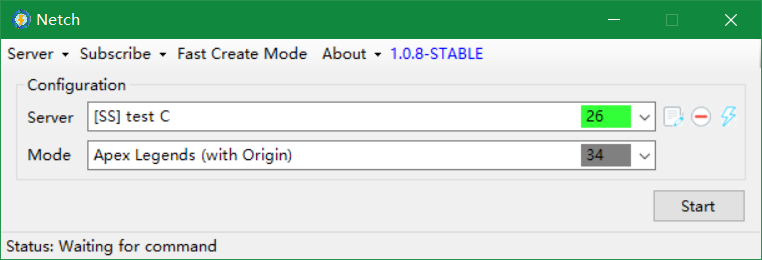

# Netch

Game accelerator

[简体中文](docs/README.zh-CN.md) (此版本内容更丰富)

## TOC

1. [Download and Installation](#download-and-installation)
2. [Description](#description)
3. [Usage](#usage)
4. [Screenshots](#screenshots)
5. [Requirements](#requirements)
6. [Explanatory note](#Explanatory-note)

## Download and Installation

Current release is portable. Unzip and click to run. Currently only support windows.

**Attention**

- Windows-64bit system install the x64 one.
- Windows-32bit system install the x86 one.
- Otherwise you will encounter some driver-related problems.

[Latest Release](https://github.com/netchx/Netch/releases)

## Description

Netch is an open source game accelerator. Unlike [SSTap](https://www.sockscap64.com/sstap-enjoy-gaming-enjoy-sstap/), which needs to add rules to function as a blacklist proxy, Netch is more similar to [Sockscap64](https://www.sockscap64.com/homepage/), which can scan the game directory to get their process names specifically and forward their network traffic through the proxy server. Now supports Socks5, Shadowsocks, ShadowsocksR, Vmess.

As well, Netch avoid the restricted NAT problem caused by SSTap<escape><a name = "ref_1_s"><a href="#ref_1_d">[1]</a></a></escape>. You can use an NATTypeTester<escape><a name = "ref_2_s"><a href="#ref_2_d">[2]</a></a></escape> to test out what your NAT type is. When using SSTap to speed up some P2P gaming connections or the game is required for that kind of open NAT type, you may experience some bad situations such as unable to join the game.

## Usage

[USAGE.md](docs/USAGE.md)

## Screenshots

## Requirements

- [.NET Framework 4.8](https://dotnet.microsoft.com/download/dotnet-framework/net48)

## Explanatory note

Click up arrow to go back.

<escape><a name = "ref_1_d"><a href = "#ref_1_d">[1]</a></a>&nbsp;<a href = "#ref_1_s">&nbsp;↑&nbsp;</a>&nbsp;<a href = "https://en.wikipedia.org/wiki/Network_address_translation#Methods_of_translation">Network address translation wikipedia</a> <a name = "ref_2_d"><a href = "#ref_2_d">[2]</a></a>&nbsp;<a href = "#ref_2_s">&nbsp;↑&nbsp;</a>&nbsp;<a href = "https://github.com/HMBSbige/NatTypeTester">NATTypeTester</a></escape>
