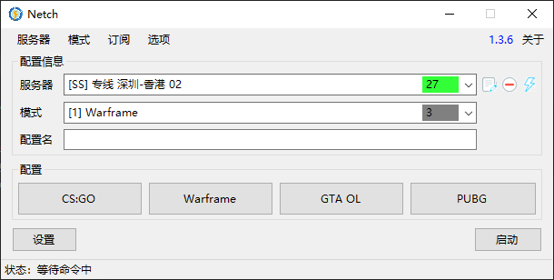
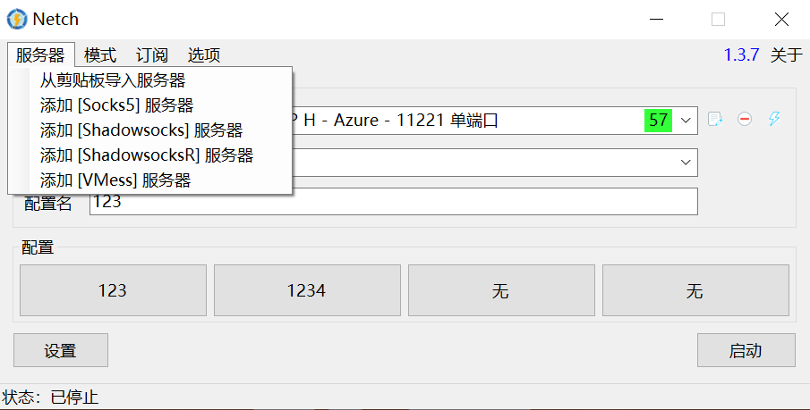
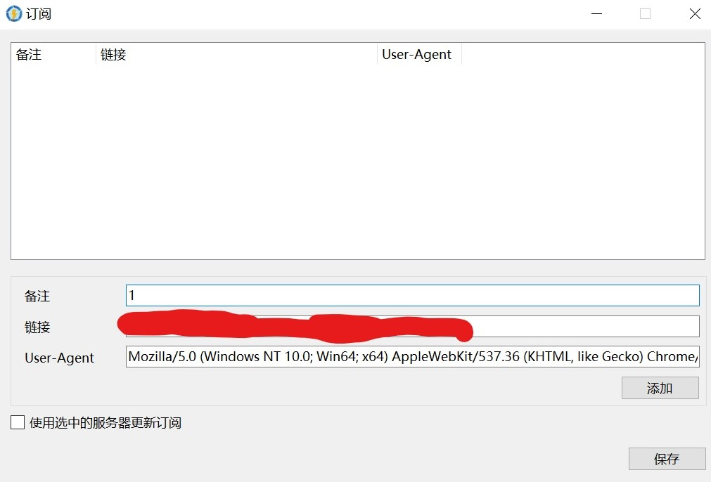

# 新手入门
**Version : 1.3.7**

[下载地址](https://github.com/NetchX/Netch/releases)

## 主界面

## 添加服务器

> Netch 目前仅支持以下代理协议：Shadowsocks，VMess，Socks5，ShadowsockR。

首先，点击`服务器`增加所需服务器

可手动添加单个服务器，或者通过剪切板链接添加单个服务器。也可通过订阅链接批量添加。

点击 `订阅` ` 管理订阅链接` 进入以下界面。

填写备注与链接，点击添加，然后保存。保存后点击 `订阅` ` 从订阅链接更新服务器`。完成服务器添加。添加完服务器后可对服务器进行修改，删除和测速。

## 选择模式

> 此处需要会一点英语，比如你应该知道 `吃鸡` 的英文名称是 `PlayerUnknown's Battlegrounds`

1.3.7 上线了模式搜索功能，即在模式框里输入字符即可搜索，使用英文名称进行搜索，搜索到所需的模式后单击选择，启用模式。相对应的游戏即可被加速

若没有所需的模式，请选择 `[3] Bypass LAN and China (TUN/TAP)` 的模式。此模式需要安装 [TAP-Windows](https://github.com/OpenVPN/tap-windows) 适配器，如果 Netch 提示没有该适配器，可以直接安装 [TAP-Windows](https://build.openvpn.net/downloads/releases/latest/tap-windows-latest-stable.exe) 来获得该适配器

关于更多的模式说明，详见 [进阶用法](https://github.com/NormanBB/NetchMode/blob/master/docs/README.zh-CN.md)。

选择完模式后，点击启用，游戏已被代理。这一步需在开启游戏前完成。

## 配置说明

目前，Netch 支持自定义四个配置，填入配置名，选择相应的服务器和游戏模式，按下 `Ctrl` 与鼠标左键，即可保存当前配置。下次使用时，点击配置名即可快速启用。

~~ 如果你还觉得不会用，可以去用 SSTap (逃~~
