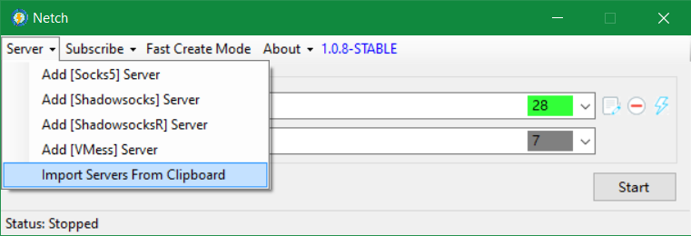
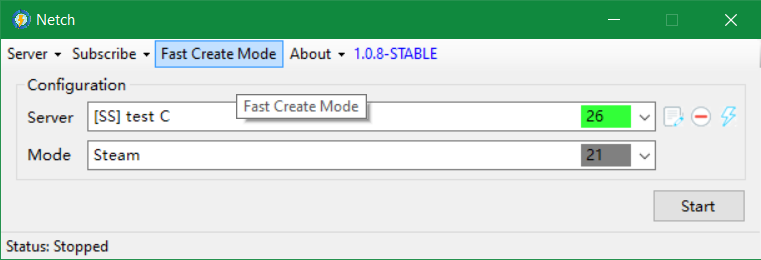
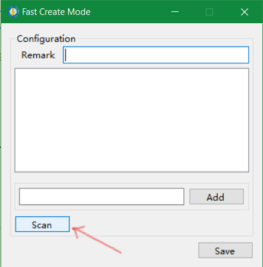
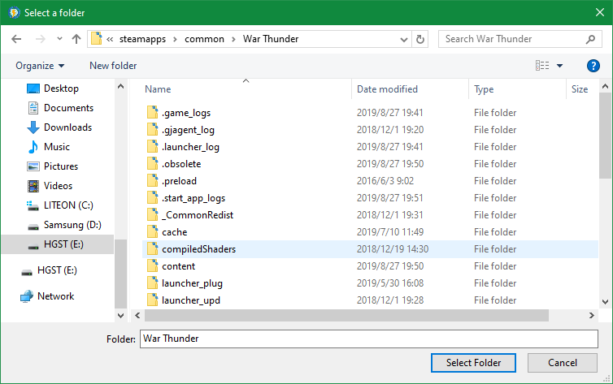
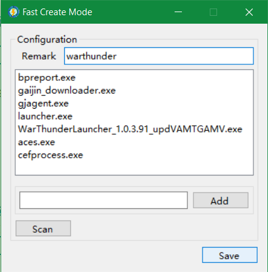
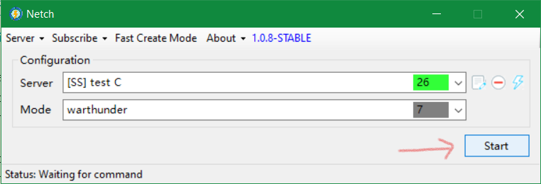

# Usage

## TOC

1. [Step by Step](#step-by-step)
   - 1.1 [Add Proxy Servers](#add-proxy-servers)
   - 1.2 [Fast Create Mode](#fast-create-mode)
   - 1.3 [Scan](#scan)
   - 1.4 [Start](#start)

## Step by Step

- Now Netch is under early development. Several changes may happen in the later releases. This guide for usage is just for your information.

### Add Proxy Servers

You can add it manually by filling in the input bars or importing URL from the clipboard. This demo uses the latter.

If your proxy protocol is currently not supported, you can manually add a socks5 server config to forward the network traffic to your proxy client's local socks5 server.

If you found that your program visual is not as clear as the one in the screenshot, you can right-click Netch.exe - Properties - Compatibility - Change High DPI Settings - Override High DPI scaling behavior - System (Enhanced).

### Fast Create Mode

If your game name is on the mode list, you can use it directly by choosing it. All the mode files is under `./mode/` folder. You can use Notepad to open, modify or combine them.

The green number in the right corner of the server bar is the ping number. It may not be accurate since it is just the delay between you and the proxy server not the game server.

If your game name isn't on the list, you can try next step to manually create it.

Then click the Fast Create Mode on the menu.

### Scan

Click Scan in the pop-up window.

Browse the installation path of the game which you want to accelerate. Depends on the game, you may need to scan different paths. Reference [eaglemoe's blog](https://www.eaglemoe.com/archives/142).

>4. Browse the GTA5 installation path. Click OK. Program will auto-scan and add all the exe files in the folder.
>5. Click the scan twice. Browse the socialclub installation path(normally in `C:\Program Files\Rockstar Games\Social Club`). Then Click OK and Save.
>
>Note: Don't forget to add the SNS part of the game at the same time. For example, adding socialclub when adding GTA. Adding Uplay when adding Rainbow Six Siege.

This demo takes Warthunder as the example. Since Warthunder can launch without Steam, just add its installation path is OK.

It may take a few seconds to scan. Remember to fill in the Remark bar. If you need to add a single exe file, you can enter it in the edit bar to the left of the Add button.

After that, click the Save button.

### Start
Make sure the contents in the Server bar and the Mode bar are exactly what you need. Next click Start.

After starting, you can launch the game by itself or use the launcher. Then the game's network traffic is in the proxy tunnel.

If you start the game before starting the Netch, restarting the game is recommended.

If you need the launcher's network traffic forwarded to the Netch, follow the previous method to scan the installation path of the launcher like Steam or Uplay.
