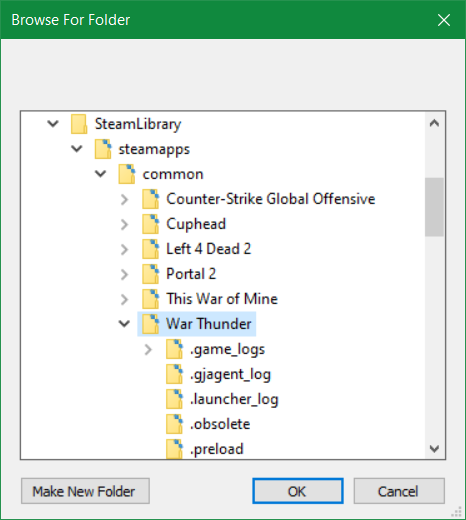

# 使用方法

其他中文教程：

- [【教程】运用 Netch ，享受游戏 - 萌鹰研究所](https://www.eaglemoe.com/archives/142)
- [Netch：一款开源的网络游戏加速工具 - Rat's Blog](https://www.moerats.com/archives/959/)

## 目录

1. [模式介绍](#模式介绍)
2. [新建进程代理模式](#新建进程代理模式)
   - 2.1 [模式](#模式)
   - 2.2 [扫描](#扫描)
   - 2.3 [启动](#启动)
3. [线路选择](#线路选择)
4. [配合 udp2raw 使用](#配合-udp2raw-使用)

## 模式介绍

目前 Netch 有以下五种模式可用。模式号即模式菜单中最左边中括号内数字。

- 模式 1：进程代理模式
  - 根据进程名进行代理
- 模式 3：TUN/TAP 全局代理模式
  - 可以通过左下角的`设置`来配置直连 IP 段
- 模式 4：HTTP 系统代理
  - 默认地址和端口为 127.0.0.1:2802
  - 会被设置为系统代理
- 模式 5：Socks5 代理
  - 默认地址和端口为 127.0.0.1:2801
  - 不会被设置为系统代理
  - 注意如果是使用 Firefox 的网络设置，请仅设置 Socks5 代理，清除其他代理配置，并取消勾选`为所有协议使用相同的代理服务器`
- 模式 6：Socks5 和 HTTP 代理
  - Socks5 代理的地址和端口为 127.0.0.1:2801
  - HTTP 代理的地址和端口为 127.0.0.1:2802
  - 不会被设置为系统代理

以及是否 Bypass China，如果模式名中有 Bypass China 的部分，即该模式会跳过国内 IP 段

## 新建进程代理模式

- 现在软件还处在早期开发阶段，可能后续版本会发生很大变化，操作仅供参考

当前版本已添加配置编辑功能，根据自己的情况，使用订阅或者别的方法添加代理配置，我这里使用的是剪贴板导入

如果你想使用的代理工具目前 Netch 还不支持，可以通过 Socks5 代理进行中转，也就是让 Netch 访问你的代理工具提供的 Socks5 代理

如果你发现你的程序没我截图的看起来清晰，可以右键`Netch.exe - 属性 - 兼容性 - 更改高 DPI 设置 - 替代高 DPI 缩放执行 - 系统（增强）`

### 模式

如果你的游戏的模式已经被收录，也可以考虑在模式菜单中，选择使用已收录的模式。所有模式的文件，都在 `./mode/` 文件夹下，如果你需要多个模式的合并文件，可以使用记事本将其打开，将多个文件合并

ping 的值未必准确，因为这只是你本地到代理服务器而非游戏服务器的延迟

如果你的游戏的模式没被收录，可以看接下来的扫描步骤来手动创建模式

接着点击菜单栏上的`模式 - 创建进程模式`

### 扫描

在弹出的窗口中点击`扫描`

选择你要加速的游戏的安装路径，根据游戏不同，可能需要选择多个不同的目录进行扫描，参见[萌鹰的 Netch 教程](https://www.eaglemoe.com/archives/142)（包括 GTAOL 和 R6S 的配置方法）

>4. 选定 GTA5 游戏目录，点击确定，软件会自动扫描目录下的 exe 程式并填写进去
>5. 再次点击扫描，选择 SocialClub 的安装地址（一般为 C:\Program Files\Rockstar Games\Social Club），点击确定，点击保存
>
>注意：加入游戏时请不要忘记加入社交组件，比如说 GTA 不要忘记 SocialClub ，彩虹六号不要忘记 Uplay

这里以战争雷霆为例，只需添加战争雷霆游戏根目录即可

扫描时可能需要稍等片刻，扫描后记得填写备注

如果需要添加单个程序，也可以在添加按钮左侧的编辑栏中手动输入并添加

之后点保存进行`保存`

### 启动

最后确认服务器一栏和模式一栏均为之前自己添加并需要使用的，没问题后点击`启动`即可

启动后，你再去游戏根目录或者别的启动器如 Steam，Uplay 启动游戏即可。此时游戏就已经被代理了

如果在 Netch 启动前就启动了游戏，建议重启游戏

如果需要 Steam，Uplay 等启动器也被代理，参照前面的方式对 Steam，Uplay 根目录也进行扫描即可

如果出现了启动失败，或者无法代理成功的情况，请先尝试`选项 - 重启服务`或`选项 - 卸载服务`，或者在退出 Netch 以后，点击运行在 Netch 根目录下的 `DriverUpdater.exe` 程序进行驱动更新

## 线路选择

普通人可以入手 [N3RO](https://n3ro.io/register?ref=530) 的线路（不负责推荐），根据 [Saber 大佬的科普](https://t.me/sabershome/197)， IPLC 的线路较为稳定

## 配合 udp2raw 使用

打算使用自己租赁的服务器加速游戏的中二人士可以了解一下，多种网络工具配合使用，战公网。如果配合 Netch 使用的话，请注意让 Netch 的协议端口填写为系列工具的接收端口

[udpspeeder + udp2raw 使用教程](https://www.moerats.com/archives/662/)

[udpspeeder + udp2raw + tinyportmapper/udpspeeder + udp2raw + kcptun batch 脚本](https://github.com/BingLingGroup/run-udp2raw-batch)
